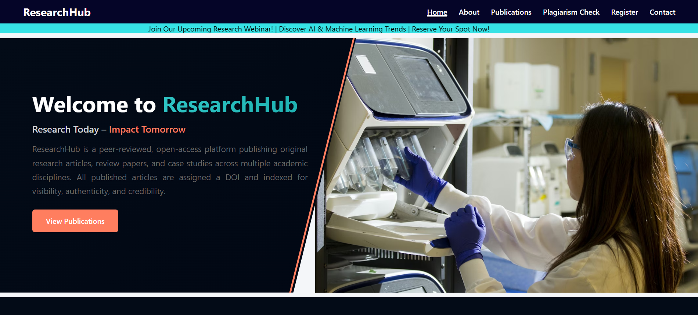
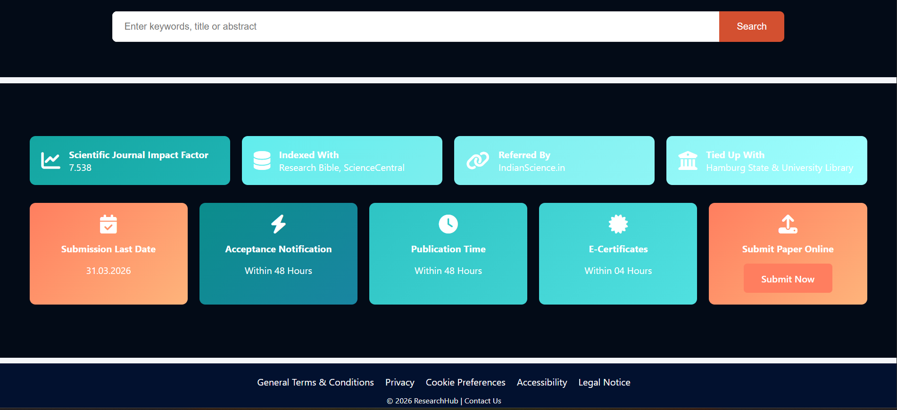

# ResearchHub - AngularJS Project

ResearchHub is a web-based project built using **AngularJS** for managing and viewing research publications.
This project demonstrates dynamic content rendering, navigation, and a basic plagiarism detection demonstration.
It allows users to view research publications, check plagiarism, and highlights AI-generated content.
The application is designed as a **responsive static web application** powered by AngularJS.

---

## Features

* View research publications with detailed information
* Demonstration of plagiarism detection
* Highlights AI-generated content for demonstration purposes
* Responsive layout with AngularJS-driven dynamic pages
* Static pages for **Register, Contact, and Paper Submission** (no backend)

---

## Project Screenshots

### Home Page

---

## Special Note on Plagiarism Detection

For demonstration purposes, the paper at the following link is recognized as **AI-generated**:

AI-written paper:
https://educationaldatamining.org/edm2024/proceedings/2024.EDM-short-papers.55/index.html

All other papers, text content, and submissions are considered **human-written** and were sourced from **Google or publicly available research materials online**.

---

## Project Structure

Research-Project
├── assets/        Images used in the project
├── css/           CSS styles
├── html/          HTML pages (Index, Home, About, Contact, Publications, Plagiarism, Register)
├── js/            AngularJS scripts

---

## How to Run

1. Clone the repository

git clone https://github.com/at-vaishnavi/ResearchHub.git

2. Open the project folder.

3. Run the application by opening **index.html** in any web browser.

---

## Tech Stack

* HTML
* CSS
* JavaScript
* AngularJS (v1.x)
* Static Web Application (No Backend)

---

## Future Improvements

* Implement full plagiarism detection for uploaded papers
* Add search and filtering for publications
* Integrate a backend for paper submission
* Store publications in a database

---

## Note

This project is created for **educational and demonstration purposes only**.
It is not deployed and does not include a backend for user submissions.

All research papers were sourced from **Google and publicly available online research content**.
